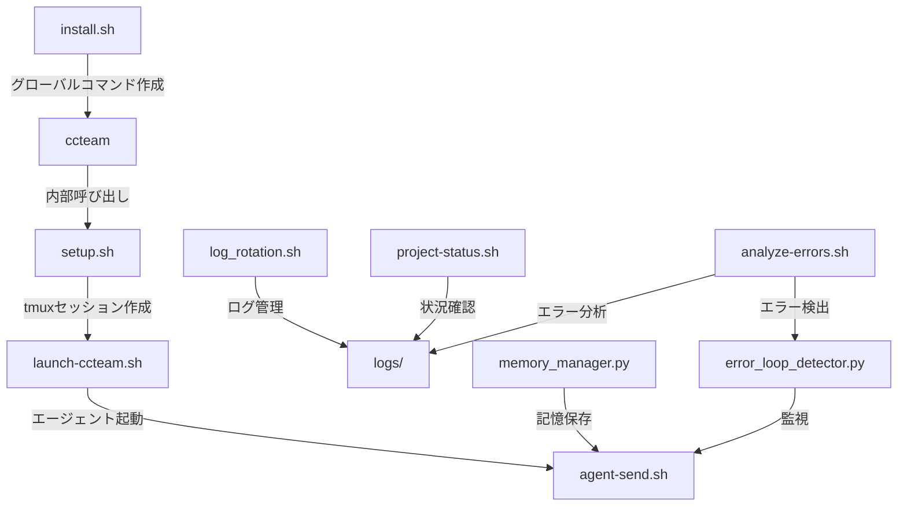

# 📚 CCTeam Scripts 完全ガイド v0.0.6

## 🏗️ スクリプトアーキテクチャ



---

## 🚀 クイックスタート

### 1. 初回セットアップ
```bash
cd ~/CC-Team/CCTeam
./install.sh              # グローバルコマンドをインストール
source ~/.bashrc          # または ~/.zshrc
```

### 2. 基本的な使い方
```bash
ccteam                    # CCTeamを起動（どこからでも！）
cca                       # 実行中のセッションに接続
ccs                       # プロジェクト状況を確認
ccsend boss "タスク開始"   # BOSSに指示を送信
```

---

## 📋 スクリプト詳細仕様

### 🎯 コアスクリプト（起動・制御）

#### `install.sh`
**目的**: グローバルコマンドのインストール
```bash
./install.sh
```
**作成されるコマンド**:
- `ccteam` → launch-ccteam.sh
- `ccteam-status` → project-status.sh
- `ccteam-send` → agent-send.sh
- `ccteam-version` → version-manager.sh
- `ccteam-attach` → tmux attach -t ccteam

**関連ファイル**:
- 出力: `/usr/local/bin/ccteam*`
- 設定: `~/.ccteam-commands`

---

#### `setup.sh`
**目的**: tmux環境の初期構築
```bash
./scripts/setup.sh
```
**処理内容**:
1. tmuxセッション作成（ccteam, ccteam-boss）
2. ペイン分割（2x2, 2分割）
3. ログファイル初期化
4. AIモデル設定（setup-models-simple.sh呼び出し）

**関連スクリプト**:
- → `setup-models-simple.sh`（AIモデル設定）
- → `launch-ccteam.sh`（次のステップ）

---

#### `launch-ccteam.sh`
**目的**: エージェントの起動と初期化
```bash
./scripts/launch-ccteam.sh [--restart]
```
**処理フロー**:
1. 安全確認プロンプト（y/n）
2. tmuxセッション確認
3. Claude Code起動（BOSS, Workers）
4. Gemini起動
5. 待機モード指示送信（最小限）

**連携**:
- ← `setup.sh`（事前実行必須）
- → `agent-send.sh`（初期指示送信）
- → `error_loop_detector.py`（エラー監視）

**v0.0.6での改善**:
- ✅ 起動確認プロンプト追加
- ✅ 初期指示を最小化（暴走防止）

---

### 💬 通信・制御スクリプト

#### `agent-send.sh`
**目的**: エージェント間のメッセージ送信
```bash
./scripts/agent-send.sh <agent> "<message>"
# agent: boss, worker1, worker2, worker3
```
**内部処理**:
1. tmuxペインマッピング
2. Ctrl+C送信（プロンプトクリア）
3. メッセージ送信
4. ログ記録（communication.log）

**関連**:
- → `logs/boss.log`, `logs/worker*.log`
- ← `error_loop_detector.py`（エラー時の指示送信）

---

### 🛡️ エラー管理・品質保証

#### `error_loop_detector.py` 🆕
**目的**: エラーループの自動検出と対処
```bash
python3 scripts/error_loop_detector.py check --agent boss --error "error message"
python3 scripts/error_loop_detector.py status
python3 scripts/error_loop_detector.py clear
```
**機能**:
- 同じエラーが3回で自動停止
- 建設的な問題解決指示を送信
- エラー履歴の管理

**連携**:
- → `agent-send.sh`（停止指示送信）
- → `error_loop_helper.py`（ヘルプ情報提供）
- ← `analyze-errors.sh`（エラー分析から呼び出し）

---

#### `error_loop_helper.py` 🆕
**目的**: エラー別の解決支援情報提供
```bash
python3 scripts/error_loop_helper.py "Cannot find module 'express'"
```
**提供情報**:
- エラータイプ別のドキュメントURL
- 具体的な解決手順
- 調査方法の提案

---

#### `analyze-errors.sh`
**目的**: ログファイルからエラーパターンを分析
```bash
./scripts/analyze-errors.sh [--last-hour|--today]
```
**連携**:
- ← 全ログファイル
- → `error_loop_detector.py`（v0.0.6で統合）

---

### 💾 データ管理

#### `memory_manager.py` 🆕
**目的**: 対話履歴とコンテキストの永続化
```bash
python3 scripts/memory_manager.py save --agent BOSS --message "タスク完了"
python3 scripts/memory_manager.py load --limit 20
python3 scripts/memory_manager.py search --query "エラー"
python3 scripts/memory_manager.py export
```
**機能**:
- SQLiteベースの記憶システム
- 対話履歴の保存・検索
- パターン学習
- スナップショットエクスポート

**データ保存先**:
- `memory/ccteam_memory.db`

---

#### `log_rotation.sh` 🆕
**目的**: ログファイルの自動管理
```bash
./scripts/log_rotation.sh
./scripts/setup_log_rotation.sh  # cron登録用
```
**処理**:
- 10MB以上のログを圧縮
- 30日以上前の圧縮ログを削除
- ディスク使用率警告

---

### 📊 監視・レポート

#### `project-status.sh`
**目的**: プロジェクト全体の状況確認
```bash
./scripts/project-status.sh
```
**表示内容**:
- エージェントの稼働状況
- 最新のログエントリ
- エラー統計
- システムリソース

---

#### `auto-report.sh`
**目的**: 定期レポートの自動生成
```bash
./scripts/auto-report.sh [cron|summary]
```
**出力**: `reports/daily-report-YYYYMMDD.md`

---

### 🔖 バージョン・品質管理

#### `version-manager.sh`
**目的**: セマンティックバージョニング
```bash
./scripts/version-manager.sh bump "修正内容"    # 0.0.1 → 0.0.2
./scripts/version-manager.sh minor "新機能"      # 0.0.2 → 0.1.0
./scripts/version-manager.sh major "破壊的変更"  # 0.1.0 → 1.0.0
./scripts/version-manager.sh rollback v0.0.1
./scripts/version-manager.sh history
```

---

#### `quality-gate.sh`
**目的**: コード品質チェック
```bash
./scripts/quality-gate.sh report
./scripts/quality-gate.sh ci
```
**チェック項目**:
- ログにエラーがないか
- テストカバレッジ
- Gitの状態

---

### 🔧 ユーティリティ

#### `safe-delete.sh`
**目的**: ファイルの安全な削除と復元
```bash
./scripts/safe-delete.sh delete file.txt
./scripts/safe-delete.sh restore file.txt
./scripts/safe-delete.sh list
./scripts/safe-delete.sh clean  # 30日以上前を削除
```

---

#### `claude-sdk-integration.sh`
**目的**: Claude Code SDK の統合
```bash
./scripts/claude-sdk-integration.sh
```
**作成物**:
- `scripts/claude_sdk_wrapper.py`
- `scripts/batch_processor.py`
- `scripts/claude_cicd.py`

---

#### `cleanup_obsolete_files.sh` 🆕
**目的**: 不要ファイルの一括削除
```bash
./scripts/cleanup_obsolete_files.sh
```
**v0.0.6で削除されたファイル**: 13個

---

## 🔄 スクリプト間の連携フロー

### 起動フロー
```
install.sh 
  ↓ (初回のみ)
ccteam コマンド
  ↓ (内部呼び出し)
setup.sh (tmuxセッション作成)
  ↓
launch-ccteam.sh (エージェント起動)
  ↓
agent-send.sh (初期指示送信)
```

### エラー処理フロー
```
エラー発生
  ↓
analyze-errors.sh (検出)
  ↓
error_loop_detector.py (カウント)
  ↓ (3回で)
agent-send.sh (停止指示)
  ↓
error_loop_helper.py (支援情報)
```

### データフロー
```
各エージェント
  ↓ (ログ出力)
logs/*.log
  ↓ (定期実行)
log_rotation.sh (圧縮・削除)
  ↓
analyze-errors.sh (分析)
auto-report.sh (レポート)
```

---

## 🚨 トラブルシューティング

### よくある問題と解決法

#### 1. tmuxプロンプトに文字が残る
**原因**: setup.shでのコマンド送信
**解決**: v0.0.6で修正済み

#### 2. BOSSが勝手に動き出す
**原因**: 初期指示が長すぎた
**解決**: v0.0.6で最小化済み

#### 3. エラーループに陥る
**解決**: error_loop_detector.pyが自動検出・停止

#### 4. ログファイルが肥大化
**解決**: 
```bash
./scripts/setup_log_rotation.sh  # cron登録
```

---

## 📝 設定ファイル

### `.claude/claude_desktop_config.json`
Claude Code Actions の定義（10個のカスタムアクション）

### `instructions/agent_instructions.md`
エージェント共通の行動指針

### `shared-docs/エラーループ対策.md`
エラーループ時の詳細な対処法

---

## 🔐 セキュリティ考慮事項

1. **APIキー**: 環境変数で管理（スクリプトにハードコードしない）
2. **ログファイル**: 機密情報を含む可能性があるため、.gitignoreに追加
3. **権限管理**: 実行権限は必要最小限に
4. **エラー情報**: スタックトレースに機密情報が含まれないよう注意

---

## 🚀 今後の拡張予定

1. **Phase 3（2週間以内）**
   - CI/CD完全統合
   - 動的チーム構成
   - Gemini API統合

2. **Phase 4（1ヶ月以内）**
   - Git Worktree並列開発
   - スマートモデル選択
   - Webダッシュボード

---

## 📞 サポート

問題が発生した場合：
1. まず本ドキュメントを確認
2. `logs/system.log`を確認
3. `python3 scripts/error_loop_detector.py status`でエラー状況確認
4. GitHub Issuesで報告

---

**最終更新**: 2025年1月9日 v0.0.6